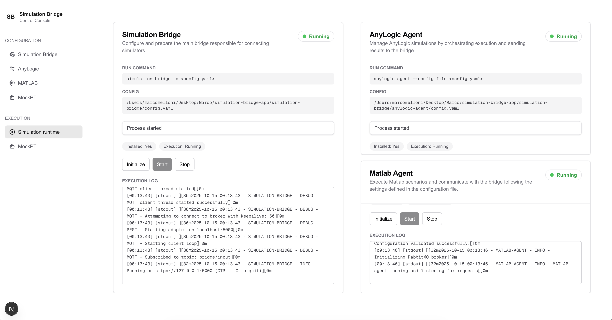

# Simulation Bridge App

A web interface for configuring and controlling [Simulation Bridge](https://github.com/INTO-CPS-Association/simulation-bridge) and its associated agents.



https://github.com/user-attachments/assets/9f3e1cf7-070b-4695-be3a-cccb917bf3f0

## Prerequisites

- **Node.js 18+** and npm
- **Python 3.12+** installed system-wide
- `pip` available in PATH (no virtual environments for main packages)

## Setup

### 1. Install Python Packages

Install the provided packages from the `dist/` directory (run once in your global Python environment):

```bash
pip install dist/simulation_bridge-0.1.1-py3-none-any.whl
pip install dist/anylogic_agent-0.1.0-py3-none-any.whl
pip install dist/matlab_agent-1.0.0-py3-none-any.whl
```

### 2. Setup MockPT Environment

Create a virtual environment for MockPT and install dependencies:

```bash
cd MockPT
python3 -m venv .venv
source .venv/bin/activate
pip install -r requirements.txt
```

### 3. Install Node Dependencies

```bash
npm install
```

## Running the Application

```bash
npm run dev
```

Access the console at <http://localhost:3000>.
